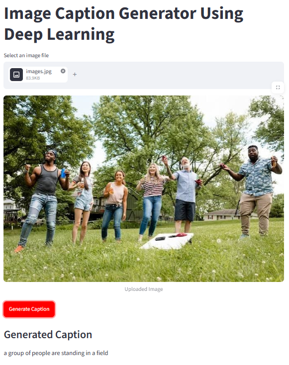
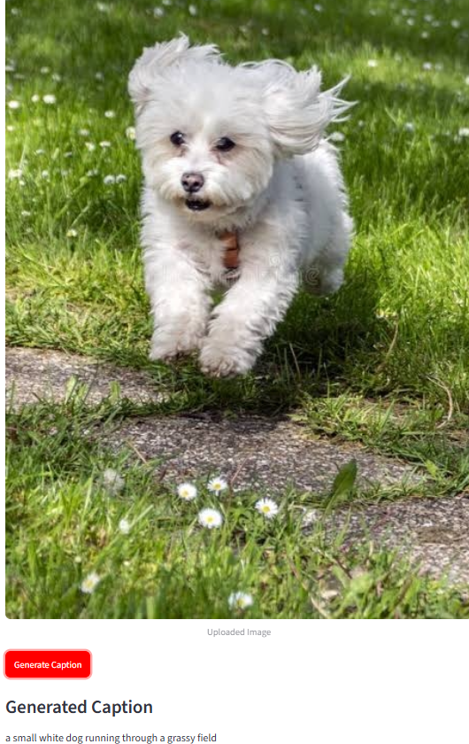

# 🖼️ Image Caption Generator

An end-to-end deep learning project that automatically generates descriptive captions for images using a combination of Convolutional Neural Networks (CNN) and Recurrent Neural Networks (RNN).

## 🚀 Demo

https://github.com/user-attachments/assets/9ee9ad25-fdd0-4d47-b866-3bd4102ba331

---

## 🏗️ Model Architecture

The system follows an **Encoder-Decoder** architecture to translate visual information into natural language.

### 1. Encoder (CNN)
We use **ResNet50**, a deep residual network pre-trained on the **ImageNet** dataset.
- **Input**: Image of size `(224, 224, 3)`.
- **Process**: The final classification layer is removed, and we extract features from the second-to-last layer.
- **Output**: A **2048-dimensional feature vector** representing the image's content.

### 2. Decoder (RNN/LSTM)
The decoder is a custom sequence-to-sequence model that predicts the next word in a caption based on the image features and the words generated so far.
- **Image Path**: The 2048-dim vector is passed through a `Dense` layer (256 units, ReLU).
- **Text Path**: Captions are passed through an `Embedding` layer (dim=50, initialized with **GloVe** weights) followed by an `LSTM` layer (256 units).
- **Fusion**: The image and text representations are summed together (`Add` layer).
- **Output**: A final `Dense` layer with a `softmax` activation over the vocabulary size to predict the next token.

**Architecture Summary:**
`Image` $\rightarrow$ `ResNet50` $\rightarrow$ `Dense(256)` $\searrow$
$\qquad\qquad\qquad\qquad\qquad\qquad\qquad\qquad\quad$ `Add` $\rightarrow$ `Dense(256)` $\rightarrow$ `Softmax` $\rightarrow$ `Caption`
`Text` $\rightarrow$ `Embedding(50)` $\rightarrow$ `LSTM(256)` $\nearrow$

---

## 📊 Dataset & Training

- **Dataset**: [Flickr30k]([https://www.kaggle.com/datasets/adityapathak/flickr30k](https://www.kaggle.com/datasets/matheusmt/flickr30k)) (contains 31,000 images with 5 captions each).
- **Word Embeddings**: **GloVe 6B (50d)** used to provide semantic meaning to words.
- **Training**: 
    - **Optimizer**: Adam
    - **Loss Function**: Categorical Cross-Entropy
    - **Epochs**: 30
- **Weights**: The final trained weights are stored in `model_checkpoints/model_30.h5`.

### 🔍 Vocabulary & Caption Analysis

Before training, the caption vocabulary was analyzed to understand word frequency distribution across the dataset.

**Word Cloud of Caption Frequencies**

)

The most frequent words are dominated by common structural/descriptive terms — *"man," "woman," "people," "two," "wearing," "standing"* — reflecting the nature of Flickr30k's captions, which mostly describe people engaged in everyday activities and their appearance.

**Least Frequently Appearing Words**

)

A large portion of the vocabulary consists of rare, long-tail words (e.g. *"fishbowls," "bathrobes," "windsailing"*) that appear only once in the entire training set. This long-tail distribution is a known challenge for caption generation — the model sees these words so rarely during training that it struggles to learn meaningful embeddings for them, making it far more likely to default to common, generic words at inference time instead.

---

### 📈 Performance Score
The model was evaluated using the **BLEU (Bilingual Evaluation Understudy)** metric on the test set:

| Metric | Score |
| :--- | :--- |
| **BLEU-1** | 0.5693 |
| **BLEU-2** | 0.3841 |
| **BLEU-3** | 0.2543 |
| **BLEU-4** | 0.1677 |

---

## 🖼️ Sample Results

Below are real outputs from the deployed Streamlit app, showing the uploaded image alongside the caption generated by the model.

| Image | Generated Caption |
| :--- | :--- |
|  | "a group of people are standing in a field" |
|  | "a construction worker in a blue shirt is digging a hole" |
|  | "a small white dog running through a grassy field" |

---

## 🛠️ Installation & Usage

### Prerequisites
- Python 3.x
- TensorFlow / Keras
- Streamlit
- NumPy, Pandas, Pillow

### Setup
1. Clone the repository:
   ```bash
   git clone https://github.com/your-username/Image-caption-generator.git
   cd Image-caption-generator
   ```
2. Install dependencies:
   ```bash
   pip install -r requirements.txt
   ```

### Running the App
The project includes a user-friendly interface built with **Streamlit**.
```bash
streamlit run app.py
```
Once the app starts, upload any image (JPG/PNG) and click **"Generate Caption"** to see the magic!

---

## 📂 Project Structure
```text
├── app.py                      # Streamlit web application
├── caption_generator.py       # Model loading and inference logic
├── model_build.ipynb           # Model architecture and training notebook
├── model_checkpoints/          # Saved model weights (.h5 files)
├── TextFiles/                  # Word mappings, tokens, and GloVe embeddings
├── screenshots/                # Sample result images referenced in this README
├── assets/                     # Dataset analysis charts (word cloud, word frequency)
└── README.md                   # You are here!
```
