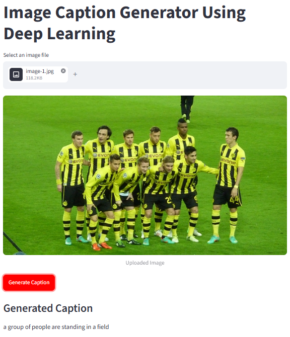

# 🖼️ Image Caption Generator — Flickr30K

> Generating natural language descriptions of images using deep learning — a CNN encoder (ResNet50) paired with an LSTM decoder, trained on the Flickr30K dataset and deployed as an interactive Streamlit app.

---

## 📌 Overview

This project builds an end-to-end **image captioning system** that takes any image as input and generates a human-readable caption describing its contents. It combines:

- **Computer Vision** — a pretrained ResNet50 CNN extracts a 2048-dimensional feature vector summarizing the visual content of an image.
- **Natural Language Processing** — an LSTM-based decoder learns to generate captions word-by-word, conditioned on the image features.
- **Deployment** — a Streamlit web app lets users upload any image and get a generated caption in real time.

The model is trained on **Flickr30K**, a dataset of ~31,000 images, each paired with 5 human-written reference captions.

---

## 🎥 Demo

Upload an image → the app encodes it with ResNet50 → the trained LSTM decoder generates a caption word-by-word until it predicts an end-of-sequence token.

```
Input:  [image of a dog running on a beach]
Output: "a brown dog is running through the sand near the water"
```

### 🎬 Video Walkthrough

https://github.com/user-attachments/assets/demo_video.webm

*(See "How to add your own demo video" below to replace this with your actual recording.)*

---

## 🏗️ Architecture

```
                     ┌─────────────────────┐
   Input Image  ───▶ │   ResNet50 (CNN)     │ ───▶  2048-dim feature vector
                     │   (pretrained,       │
                     │    ImageNet weights) │
                     └─────────────────────┘
                                │
                                ▼
                     ┌─────────────────────┐
   Previous word ───▶ │  Embedding + LSTM   │ ───▶  Next predicted word
   (or <start>)       │     Decoder         │
                     └─────────────────────┘
                                │
                                ▼
                        Repeat until <end>
```

**Encoder:** ResNet50 (pretrained on ImageNet), with the final classification layer removed — used purely as a fixed feature extractor (no fine-tuning).

**Decoder:** An Embedding layer (initialized/sized for the project's vocabulary) feeding into an LSTM, merged with the image feature vector through a dense layer, followed by a final softmax layer over the vocabulary to predict the next word.

**Caption generation:** Greedy search — at each timestep, the model picks the single highest-probability next word, appends it, and feeds it back in as input for the next step, until it predicts `endseq` or hits the maximum caption length.

---

## 📊 Dataset

- **Flickr30K** — ~31,783 images, each with 5 human-annotated captions (~158,000 captions total).
- Captions were lowercased, stripped of punctuation, and wrapped with `startseq` / `endseq` tokens during preprocessing.
- Images were resized to 224×224 and normalized to match ResNet50's expected input format.

> 📥 The dataset is **not included** in this repository due to its size. Download it from [Kaggle](https://www.kaggle.com/datasets/hsankesara/flickr-image-dataset) and place it in a local folder before running the preprocessing notebook.

---

## 📈 Results

The model was evaluated on a held-out test split using **BLEU** (Bilingual Evaluation Understudy) scores, the standard metric for comparing generated text against multiple human references.

| Metric | Score |
|--------|-------|
| BLEU-1 | 0.568 |
| BLEU-2 | 0.381 |
| BLEU-3 | 0.254 |
| BLEU-4 | 0.165 |

These scores are consistent with — and slightly competitive against — published baselines for CNN+LSTM captioning models without an attention mechanism trained on Flickr-style datasets.

<details>
<summary>📷 Sample generated captions</summary>

| Image | Generated Caption |
|-------|--------------------|
|  | "a group of people are standing in a field" |
|  | "a group of people are standing in a field" |
|  | "a small white dog running through a grassy field" |

> ⚠️ Note: the first two examples both generated the same generic caption despite showing different scenes (a football team photo and friends playing a lawn game) — a known limitation of greedy search with a single pooled image feature vector and no attention mechanism. Adding attention (see [Future Improvements](#-future-improvements)) would help the decoder distinguish finer visual detail in group scenes like these.

</details>

---

## 🗂️ Project Structure

```
Image-Caption-Generator-Flickr30K/
│
├── text_data_processing.ipynb   # Cleans captions, builds vocabulary & word-index mappings
├── model_build.ipynb            # Extracts ResNet50 features, builds & trains the captioning model
├── caption_generator.py         # Loads trained model + generates captions (inference logic)
├── ui.py                        # Legacy Tkinter desktop GUI
├── app.py                       # Streamlit web app (recommended interface)
│
├── TextFiles/
│   ├── word_to_idx.pkl          # Word → index vocabulary mapping
│   └── idx_to_word.pkl          # Index → word vocabulary mapping
│
├── model_checkpoints/
│   └── model_30.h5              # Trained model weights
│
├── .gitignore
└── README.md
```

---

## ⚙️ Installation

**1. Clone the repository**
```bash
git clone https://github.com/AvinashOraon123/Image-Caption-Generator-Flickr30K.git
cd Image-Caption-Generator-Flickr30K
```

**2. Create a virtual environment**
```bash
python -m venv venv
venv\Scripts\activate        # Windows
source venv/bin/activate     # macOS/Linux
```

**3. Install dependencies**
```bash
pip install tensorflow keras streamlit numpy pandas pillow matplotlib nltk
```

**4. Download the dataset (for training only)**
Download Flickr30K from [Kaggle](https://www.kaggle.com/datasets/hsankesara/flickr-image-dataset) if you plan to retrain the model from scratch. Skip this step if you're only running inference with the provided checkpoint.

---

## 🚀 Usage

### Option 1 — Streamlit App (recommended)
```bash
streamlit run app.py
```
Opens an interactive web interface in your browser — upload an image, click **Generate Caption**, and view the result.

### Option 2 — Retrain from scratch
1. Run `text_data_processing.ipynb` to preprocess captions and build the vocabulary.
2. Run `model_build.ipynb` to extract image features and train the model.
3. Trained weights are saved to `model_checkpoints/`.

> 💡 Training on the full dataset is computationally intensive. Using **Google Colab with a free GPU runtime** is strongly recommended over training locally on CPU.

---

## 🧠 Tech Stack

| Category | Tools |
|----------|-------|
| Deep Learning | TensorFlow, Keras |
| Computer Vision | ResNet50 (transfer learning) |
| NLP | LSTM, Embedding layers |
| Evaluation | NLTK (BLEU score) |
| Deployment | Streamlit |
| Data | Flickr30K dataset |

---

## 🔮 Future Improvements

- [ ] Add an **attention mechanism** (Bahdanau/Luong-style) so the decoder focuses on relevant image regions per word, rather than a single pooled feature vector — the most impactful upgrade for BLEU-3/BLEU-4 specifically.
- [ ] Implement **beam search** decoding as an alternative to greedy search for improved caption quality.
- [ ] Add **METEOR** and **CIDEr** scores alongside BLEU for a more complete evaluation.
- [ ] Train on the full 30K-image dataset with more epochs for improved generalization.
- [ ] Deploy the Streamlit app publicly (e.g. via Streamlit Community Cloud).

---

## 📜 License

This project is open-source and available under the [MIT License](LICENSE).

---

## 🎥 How to Add Your Own Demo Video

GitHub's `README.md` doesn't render a standard HTML5 `<video>` tag from a local file path — but GitHub has built-in support for **drag-and-drop video uploads directly into any text box** (issues, PRs, or the README editor), which auto-generates an embeddable link that *does* render inline. Here's the easiest way:

1. **Record your screen** using the Streamlit app generating a caption (Windows: Xbox Game Bar with `Win + G`, or free tools like OBS Studio / ShareX).
2. Go to your GitHub repo, click **Add file → Edit README.md** directly in the browser (or open any existing Issue on your repo — either works).
3. **Drag and drop your video file** into the text editing box. GitHub uploads it and automatically inserts a link like:
   ```
   https://github.com/user-attachments/assets/xxxxxxxx-xxxx-xxxx-xxxx-xxxxxxxxxxxx
   ```
4. Copy that generated link and paste it into your README on its own line, replacing the placeholder link in the **Video Walkthrough** section above. GitHub automatically renders it as an inline playable video player once the README is viewed on GitHub.com.

**Alternative approaches**, if you'd rather not use GitHub's upload flow:

| Method | How |
|--------|-----|
| **Convert to GIF** | Use [ezgif.com](https://ezgif.com/video-to-gif) to convert a short screen recording to a `.gif`, commit it to a `screenshots/` folder, then embed with `` — GIFs render natively in any markdown, no special hosting needed. |
| **Host on YouTube** | Upload the video to YouTube (even unlisted), then embed a clickable thumbnail: `[](https://youtube.com/watch?v=YOUR_VIDEO_ID)` — clicking it opens YouTube, since GitHub markdown can't auto-play external video embeds. |
| **Link directly** | Simplest option: `[📺 Watch the demo video](link-to-video)` — just a clickable link, no inline preview. |

> 💡 The GitHub drag-and-drop method (option 1) is recommended — it plays inline directly on your repo page, works for both `.mp4` and `.mov`, and doesn't require third-party hosting.

---

## 🙏 Acknowledgments

- [Flickr30K Dataset](https://www.kaggle.com/datasets/hsankesara/flickr-image-dataset)
- ResNet50 pretrained weights via Keras Applications (ImageNet)
- Inspired by the classic "Show and Tell" neural image captioning architecture
